# 🏆 Dossier Oficial: Lançamento do 1º Simulado Nacional ENAS 2026
## Estratégia de Financiamento dos Prémios & Kit de Divulgação Viral

> **Vilhete Solutions • Plataforma ExamePronto**  
> **Data:** Outubro de 2026  
> **Mercado:** Moçambique (Todas as 11 Províncias)  
> **Alvo:** Candidatos UEM, UP, 12ª Classe e Centros Preparatórios

---

## 1. 💰 De Onde Vem o Dinheiro dos Prémios? (Engenharia Financeira & Quorum de Lucro)

Uma dúvida natural e crítica para o fundador: **"Se vamos pagar 5.000 MT para o 1º Lugar, 3.000 MT para o 2º Lugar e 1.000 MT para o 3º Lugar (Total: 9.000 MT no M-Pesa), de onde sai esse valor sem descapitalizar o negócio?"**

No mercado moderno de EdTech e plataformas digitais de alta escala, o prémio **NUNCA é uma despesa a fundo perdido**. Ele é a peça central de uma máquina de **auto-sustentabilidade e lucro imediato**. 

Existem **3 Modelos Comprovados** para financiar os 9.000 MT e gerar lucro líquido desde a primeira edição:

```mermaid
flowchart TD
    subgraph M1["Modo 1: Taxa Simbólica de Inscrição no Prêmio"]
        A1["Simulado Grátis para Treinar"] --> B1["Validação de Concorrência ao Prémio: 20 MT"]
        B1 --> C1["1.000 Alunos x 20 MT = 20.000 MT"]
        C1 --> D1["Prémios: 9.000 MT | Lucro Líquido: 11.000 MT"]
    end

    subgraph M2["Modo 2: Patrocínio de Universidades Privadas"]
        A2["UCM, ISCTEM, A Politécnica, ISUTC"] --> B2["Cota de Patrocínio: 35.000 MT"]
        B2 --> C2["Exposição de Marca para 5.000 Caloiros"]
        C2 --> D2["Patrocinador Cobre Prémios + Lucro de 26.000 MT"]
    end

    subgraph M3["Modo 3: Conversão Orgânica em Assinaturas (Quorum de Lucro)"]
        A3["150 a 300 Alunos Assinam Plano Mensal (119 MT)"] --> B3["Receita: 17.850 MT a 35.700 MT"]
        B3 --> C3["Prémios Pagos: 9.000 MT"]
        C3 --> D3["Lucro Líquido Garantido: +8.850 MT a +26.700 MT no M-Pesa"]
    end
```



---

### Detalhamento dos 3 Modelos de Receita:

#### Modelo A: O Modelo "Freemium Competitivo" (Auto-Financiado pelos Alunos)
- **Como funciona:**
  - O simulado é **100% gratuito** para quem só quer testar o seu conhecimento e ver a sua nota no ecrã.
  - Para quem quer **concorrer oficialmente às bolsas M-Pesa (5.000 MT, 3.000 MT, 1.000 MT), figurar no Ranking Oficial Provincial e receber o Certificado Nobre Verificável**, paga-se uma taxa simbólica de **20 MT** (ou o aluno já é assinante Premium).
- **A Matemática em Moçambique:**
  * 20 Meticais é menos do que o preço de um pão ou de uma corrida curta de chapa. Qualquer estudante consegue pagar via M-Pesa sem pedir permissão aos pais.
  * Com apenas **1.000 estudantes** validando o bilhete oficial a 20 MT:
    $$\text{Receita Total} = 1.000 \times 20\text{ MT} = 20.000\text{ MT}$$
    $$\text{Custo dos Prémios} = 9.000\text{ MT (1º, 2º e 3º)}$$
    $$\mathbf{\text{Lucro Líquido Imediato}} = 20.000\text{ MT} - 9.000\text{ MT} = \mathbf{11.000\text{ MT}}$$
  * Com **3.000 estudantes**:
    $$\text{Receita Total} = 60.000\text{ MT} \implies \mathbf{\text{Lucro Líquido}} = \mathbf{51.000\text{ MT}}$$

---

#### Modelo B: Patrocínio Corporativo (Universidades Privadas & Marcas)
- **Quem tem interesse em financiar os prémios?**
  1. **Universidades Privadas (UCM, ISCTEM, A Politécnica, ISUTC, Universidade São Tomás):**
     - Em Moçambique, a cada 100 alunos que fazem exames na UEM e UP, apenas 15 a 20 conseguem vaga. Os outros 80 **precisam desesperadamente de uma universidade privada**.
     - As universidades privadas gastam dezenas de milhares de meticais em panfletos que vão para o lixo.
     - Uma cota de patrocínio de **30.000 MT a 50.000 MT** coloca o logótipo da universidade como *"Patrocinadora Oficial do Talento Pré-Universitário de Moçambique"*, permitindo que elas ofereçam bolsas de desconto nos seus cursos.
  2. **Operadoras de Telefonia (Vodacom M-Pesa / Movitel e-Mola):**
     - O evento promove diretamente transações M-Pesa entre a juventude.
- **Resultado:** O patrocinador cobre os 9.000 MT de prémios e a Vilhete Solutions retém a margem de patrocínio.

---

#### Modelo C: Financiamento por Quorum de Assinaturas Mensais (CAC Negativo & Risco Zero)
- **A Regra do Quorum:** A prova oficial só é realizada quando o número de alunos no Plano Mensal atingir o mínimo estipulado pelo Administrador (ex: 150 alunos).
- Com **150 alunos** no plano mensal de **119 MT**:
  $$\text{Receita} = 150 \times 119\text{ MT} = 17.850\text{ MT}$$
  $$\text{Prémios M-Pesa} = 9.000\text{ MT}$$
  $$\mathbf{\text{Lucro Líquido Limpo}} = 17.850\text{ MT} - 9.000\text{ MT} = \mathbf{8.850\text{ MT}}$$
- Com **300 alunos**:
  $$\text{Receita} = 300 \times 119\text{ MT} = 35.700\text{ MT} \implies \mathbf{\text{Lucro de } 26.700\text{ MT}}$$

> [!TIP]
> **Recomendação Estratégica do Fundador:**
> O Simulado ENAS funciona como o principal motor de aquisição do ExamePronto. O aluno entra para competir pelos 5.000 MT, convida colegas de turma através do seu **Link de Partilha Viral (+50 XP)** e assina o plano mensal de 119 MT para ter acesso às explicações da IA e ao histórico completo de exames.

---

## 2. 📱 Kit de Textos Virais para WhatsApp & Redes Sociais

### 🟢 Copy 1: Mensagem Viral para Grupos de WhatsApp de Estudantes & Turmas
*(Disparar em grupos da 12ª Classe e preparação UEM/UP)*

```text
🇲🇿🔥 *ATENÇÃO ESTUDANTES DE MOÇAMBIQUE: A TUA VAGA VALE 5.000 MT NO M-PESA!* 🎓📲

Estás a preparar-te para os Exames de Admissão da *UEM, UP ou 12ª Classe*? Chegou a tua hora de provar que a tua província tem os melhores cérebros do país!

🏆 *1º SIMULADO NACIONAL ABERTO (ENAS 2026)*
O maior teste preparatório online em tempo real de Moçambique!

💰 *PRÉMIOS EM DINHEIRO VIVO (M-PESA):*
🥇 *1º Lugar Nacional:* 5.000 MT via M-Pesa + Troféu Virtual
🥈 *2º Lugar Nacional:* 3.000 MT via M-Pesa
🥉 *3º Lugar Nacional:* 1.000 MT via M-Pesa
🇲🇿 *Melhor de Cada Província:* Acesso Premium Anual + Certificado Nobre com QR Code

📅 *DATA:* Conforme Agendamento Oficial no Portal
⏰ *HORA:* Pontualmente às 09:00 (Fuso de Maputo)
📝 *FORMATO:* 50 Perguntas Interdisciplinares no teu telemóvel (Funciona mesmo com saldo fraco!)

💡 *Como Participar Gratuitamente:*
1. Clica no link: 👉 https://examepronto.mz/#enas
2. Preenche o teu Nome, Província e Número de WhatsApp/M-Pesa
3. Convida teus colegas de turma para ganhares +50 XP e destravares a realização da prova!

⚠️ *Vagas Limitadas por Província!* Partilha com a tua turma e vamos ver qual província leva o 1º Lugar Nacional! 🇲🇿🚀
```

---

### 🔵 Copy 2: Post para Facebook, Instagram & TikTok

```text
🎓🔥 QUAL PROVÍNCIA TEM OS MELHORES CALOIROS DE MOÇAMBIQUE? 🇲🇿

Chegou o ENAS 2026 — O Exame Nacional Aberto e Simulado em Tempo Real!

No dia da prova, pontualmente às 09:00, milhares de estudantes de Maputo a Cabo Delgado vão sentar-se simultaneamente com os seus telemóveis para disputar a liderança nacional e levar para casa prémios em dinheiro via M-Pesa:

🥇 1º Lugar: 5.000 MT no M-Pesa
🥈 2º Lugar: 3.000 MT no M-Pesa
🥉 3º Lugar: 1.000 MT no M-Pesa
🏆 Medalha de Honra ao Mérito para os melhores de cada uma das 11 províncias!

A prova é calibrada com a Teoria de Resposta ao Item (TRI) oficial usada nos exames de admissão da UEM e UP.

👉 Garante já a tua vaga gratuita em: examepronto.mz/#enas (Link na Bio)

Marca nos comentários aquele teu colega que jura que tira 20 a Matemática! 👇

#ExamesMocambique #UEM #UP #Admissao2026 #ENAS #VilheteSolutions #EducacaoMocambique #MPesa
```

---

### 🏢 Copy 3: Convite Formal para Diretores de Escolas e Centros Preparatórios

```text
Exmo(a). Senhor(a) Diretor(a) Pedagógico(a),

ASSUNTO: Convite para Participação no 1º Simulado Nacional Aberto (ENAS 2026)

A Vilhete Solutions e a Direção da Plataforma ExamePronto têm a honra de convidar os estudantes finalistas da 12ª Classe e formandos do vosso prestigiado estabelecimento de ensino a participarem do 1º Exame Nacional Aberto e Simulado (ENAS 2026).

O ENAS é uma iniciativa educacional de âmbito nacional, desenhada para avaliar o nível de preparação e prontidão dos candidatos aos Exames Nacionais e de Acesso ao Ensino Superior (UEM, UP, UniZambeze, UniLúrio) em condições reais de prova sincronizada.

BENEFÍCIOS PARA A VOSSA INSTITUIÇÃO:
1. Pauta de Desempenho Institucional: A vossa escola receberá um relatório comparativo demonstrando a posição média dos vossos alunos em relação às restantes instituições da província e do país.
2. Reconhecimento Público: As escolas com maior taxa de aproveitamento no Top 50 Nacional serão homenageadas no portal oficial e nos canais de comunicação social.
3. Premiação dos Estudantes: Bolsas de mérito em Meticais (M-Pesa) para os 3 melhores alunos nacionais e certificados verificáveis com QR Code para todos os participantes com nota positiva.

A participação é digital e acessível diretamente a partir de qualquer smartphone ou computador através do endereço: https://examepronto.mz

Colocamo-nos à inteira disposição para o fornecimento de credenciais institucionais ou cadernos em formato físico para aplicação nas vossas salas de aula.

Com os melhores cumprimentos,
Direção Executiva • ExamePronto Moçambique
Vilhete Solutions
```

---

## 3. Cronograma de Ação para o Lançamento

| Dia | Ação Operacional | Canal | Meta |
| :--- | :--- | :--- | :--- |
| **D - 15** | Publicação do Cartaz Oficial e Abertura das Inscrições Online | Redes Sociais & Grupos WhatsApp | 500 Inscritos |
| **D - 10** | Disparo nos Grêmios de Estudantes e Escolas Secundárias (Maputo, Matola, Beira, Nampula) | WhatsApp & Visitas Rápidas | 1.500 Inscritos |
| **D - 5** | Verificação do Quorum de Lucro no Painel Admin (>= 150 Assinantes) | Painel CMS ExamePronto | Confirmação Financeira |
| **D - 1** | Lembrete Oficial: "Amanhã às 09:00 — Confirma a tua bateria e conexão" | SMS / WhatsApp Bot | 90% Presença Prevista |
| **DOMINGO (09:00)** | **INÍCIO DA PROVA SINCRONIZADA EM TODO O PAÍS** | Plataforma Web / PWA | Prova ao Vivo |
| **DOMINGO (12:00)** | **Publicação do Ranking Nacional e Entrega dos Prémios M-Pesa** | Live / Redes Sociais | Viralidade Pós-Prova |
